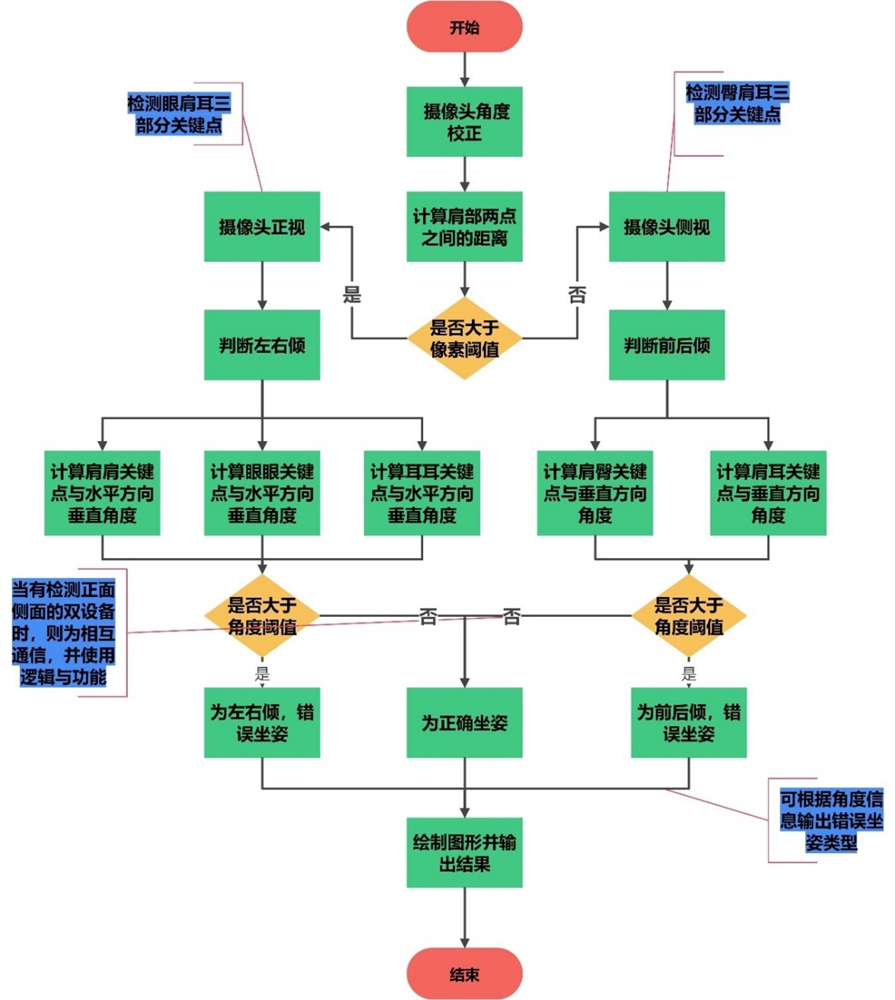
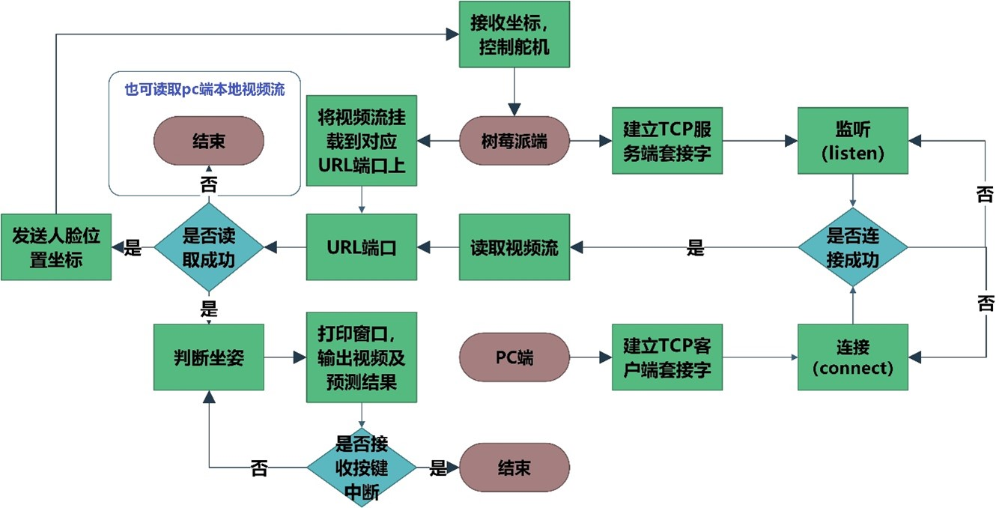

# 基于树莓派的人体坐姿实时检测系统
# Human sitting posture real-time detection system based on Raspberry PI
你好！这是一个基于树莓派的人体坐姿实时检测系统。
Hello! This is a real-time human sitting posture detection system based on Raspberry PI.

___

##  1.|*使用硬件与相关环境*| |*Hardware and Requirments*|
### 1.1硬件 Hardware
- 树莓派4B 8G ARM-32
- PCA9685PWM输出控制器
- 舵机SG90，MG90S
- ups电源（供电）
- CSI摄像头

### 1.2相关环境 Requirments
- python  3.7.3
- opencv-python  4.9.0.80
- mediapipe-rpi4  0.8.8
- Adafruit-GPIO  1.0.4
- Adafruit-PCA9685  1.0.1
- Adafruit-PureIO  1.1.11
- numpy  1.19.2

---

## 2.|*算法原理流程图*| |*Flow chart of algorithm principle*|
以下是坐姿检测的流程。
The following is the flow chart of the posture test.

***

## 3.|*部署方式*| |*Deployment*|
演示视频:
***[树莓派的坐姿实时检测]([基于树莓派的人体坐姿实时检测系统_哔哩哔哩_bilibili](https://www.bilibili.com/video/BV1Pi421Q7RN/?spm_id_from=333.337.search-card.all.click&vd_source=34b29bf413e1afc1be2ab60d2eefe873))***
### 3.1树莓派端部署
最开始系统计算肩与肩部关键点之间的距离，当该距离大于一定像素阈值时，判断测试者是保持正坐的姿势，因此，我们使用单目相机判断左右倾斜状态，判断左右倾斜的依据分别是计算肩肩关键点，眼眼关键点，耳耳关键点与水平方向的角度，当角度大于一定角度阈值时，则判断处于不良坐姿，反之，则正面为正常坐姿；当肩与肩之间像素阈值小于一定值时，则判断受试者处于侧坐状态，这时，我们判断坐姿的依据就是计算肩臀关键点，肩耳关键点与垂直方向上的夹角，当大于一定角度阈值时，判断处于不良坐姿，反之，则侧面为正常坐姿。
如果要输出具体的坐姿，则可以根据具体角度信息，以垂直方向为基准，向左为正方向，向右为负方向，计算出的角度为正即为左倾，为负即为右倾；处于侧面，前后倾判断同理。
### 3.2Client-Server部署
上面的代码就是该部署方式，该系统流程图如下。

### 3.3多角度坐姿检测部署
以上介绍的两种部署方式，都是树莓派利用单目相机判断一个角度（正面或侧面）的坐姿，为了整个坐姿检测系统的健全性，我们在这里引入正侧面双角度综合判断坐姿的方式，正面边缘端设备判断正面坐姿信息，侧面边缘端设备判断侧面坐姿信息，利用蓝牙或网络的方式相互通信，综合判断坐姿，具体原理和上述原理一样，这里不做赘述。

---

## 4.|*参考文档*| |*reference*|
### 4.1相关代码参考：
侧坐代码：
https://colab.research.google.com/github/spmallick/learnopencv/blob/master/Posture-analysis-system-using-MediaPipe-Pose/human_posture_analysis.ipynb

挂载视频流：
https://github.com/jacksonliam/mjpg-streamer

舵机控制：
https://blog.csdn.net/rikeilong/article/details/126446567?spm=1001.2014.3001.5502